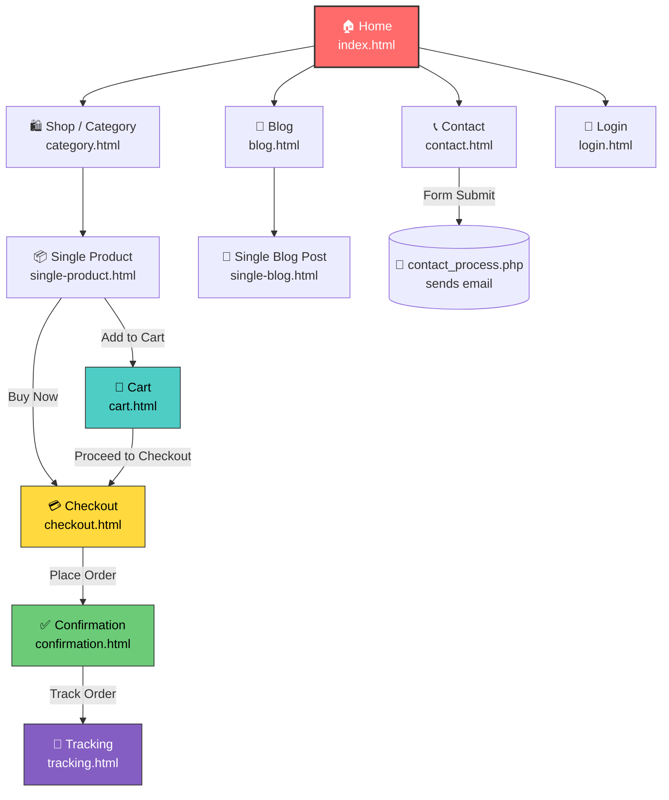

# 🛏️ DreamyNest — E-commerce Website (HTML Template)

This is a **static front-end e-commerce website** built for selling mattress/furniture products (HTML, CSS, Bootstrap, and jQuery based). This README explains the **complete website flow**, the **purpose of each page**, and includes a **visual diagram** so that anyone (developer or client) can understand how the site works in just a few minutes.

---

## 📌 Project Overview

| | |
|---|---|
| **Project Name** | DreamyNest |
| **Type** | Static Front-end E-commerce Template |
| **Niche** | Orthopedic Foam Mattress / Home Furniture |
| **Tech Stack** | HTML5, CSS3, Bootstrap, jQuery, PHP (contact form only) |
| **Libraries Used** | Owl Carousel, Slick Slider, Swiper, AOS (animations), Magnific Popup, Nice Select, LightSlider |
| **Total Pages** | 13 HTML pages |

---

## 📂 Folder Structure

```
1/
├── index.html              → Homepage
├── category.html           → Shop / Product Listing
├── single-product.html     → Single Product Detail
├── cart.html                → Shopping Cart
├── checkout.html            → Checkout / Order Form
├── confirmation.html        → Order Confirmation
├── tracking.html            → Order Tracking
├── login.html                → Login / Register
├── blog.html                  → Blog Listing
├── single-blog.html          → Single Blog Post
├── contact.html               → Contact Us
├── elements.html              → UI Components / Elements Showcase
├── contact_process.php        → Contact form backend (PHP mail)
├── css/                          → All stylesheets (Bootstrap, custom style.css, etc.)
├── js/                            → All JS (jQuery, sliders, animations, form validation)
├── img/                            → All images (products, banners, icons, blog, etc.)
├── fonts/ & webfonts/              → Icon fonts (FontAwesome, Themify, Flaticon)
└── sass/                            → SCSS source files (source of style.css)
```

---

## 🧭 Website Flow — Where Each Click Takes You

Every page has a **top navbar** with a dropdown menu that lets you jump **directly to any page from any page** — so navigation is "global" in that sense. But the **logical user journey** works like this:

### 1️⃣ Home (`index.html`)
- The website's **entry point**. Shows the hero banner, featured products, offers, and a blog preview.
- **Click "Shop Category"** → takes you to `category.html` (to browse the product list).
- **Click on any product image / "View Details"** → takes you to `single-product.html`.
- **Navbar → Blog** → takes you to `blog.html`.
- **Navbar → Contact** → takes you to `contact.html`.

### 2️⃣ Category / Shop (`category.html`)
- All products are shown in a **grid/list**, with filter/sort options.
- **Click on any product** → opens `single-product.html` (that product's detail page).

### 3️⃣ Single Product (`single-product.html`)
- Full product details — images, price, description.
- **Click "Add to Cart"** → takes you to `cart.html`.
- **Click "Buy Now" / direct checkout button** → takes you to `checkout.html`.

### 4️⃣ Cart (`cart.html`)
- Lists the products you've added (with quantity change/remove options).
- **Click "Proceed to Checkout"** → takes you to `checkout.html`.

### 5️⃣ Checkout (`checkout.html`)
- The user fills in shipping/billing details and chooses a payment method.
- **On placing the order** → takes you to `confirmation.html`.

### 6️⃣ Order Confirmation (`confirmation.html`)
- The "Thank you" / order-successful page.
- From here, the user can **click "Track Order"** → takes you to `tracking.html`.

### 7️⃣ Order Tracking (`tracking.html`)
- Shows the order's current status/stage (e.g., Order Placed → Packed → Shipped → Delivered).

### 8️⃣ Login / Register (`login.html`)
- Login form for existing users, or sign-up form for new ones (front-end only, no backend attached).
- Can be reached directly from the navbar on any page.

### 9️⃣ Blog (`blog.html`) → Single Blog (`single-blog.html`)
- `blog.html` shows a list of all blog posts.
- **Click "Read More" on any post** → opens `single-blog.html` with the full post detail.

### 🔟 Contact (`contact.html`)
- Has a contact form that submits to **`contact_process.php`** — this PHP file sends an email (reads name/email/message from `$_REQUEST` and uses the `mail()` function).
- ⚠️ **Note:** This form only works when the site is hosted on a **PHP-enabled server** (like cPanel/Apache+PHP). If you're just using VS Code's Live Server locally, it won't work — you'll need a PHP server (XAMPP/WAMP or real hosting).

### 1️⃣1️⃣ Elements (`elements.html`)
- This is a **UI components showcase page** (examples of buttons, alerts, typography, forms) — not meant for the end user, it's a developer reference page included in the template.

---

## 🗺️ Visual Flow Diagram



> 💡 **Note:** This diagram uses [Mermaid](https://mermaid.js.org/) syntax — it will **render automatically** as a visual flowchart on GitHub, GitLab, and VS Code (with the Mermaid extension). A plain-text version is also included below in case you need it.

### 🔤 Text-based Flow (Simple Version)

```
Home
 ├──> Shop / Category ──> Single Product ──┬──> Cart ──> Checkout ──> Confirmation ──> Tracking
 │                                          └──────────────> Checkout
 ├──> Blog ──> Single Blog Post
 ├──> Login
 └──> Contact ──> (PHP mail sent via contact_process.php)
```

---

## ⚙️ How to Run Locally

1. Extract the zip file.
2. Open `index.html` directly in any browser — the entire static part of the site will run immediately.
3. To test the **contact form**, you'll need a PHP server:
   - Install XAMPP/WAMP and place the project folder inside `htdocs`/`www`.
   - Open `http://localhost/<folder-name>/index.html` in your browser.

---

## 🧩 Key Notes for Developers

- This is a purely **static template** — there's no database or backend (just a small PHP script for the contact form).
- All pages share an **identical navbar and footer** — the global dropdown menu lets you jump directly to any page.
- If you want to make it dynamic (real cart, real checkout, real login), you'd need to integrate a backend framework (like Django or Node.js) — right now it's purely a UI/frontend demo.

---

<p align="center">Made with 🛏️ for DreamyNest — Documentation generated for easy project understanding.</p>
